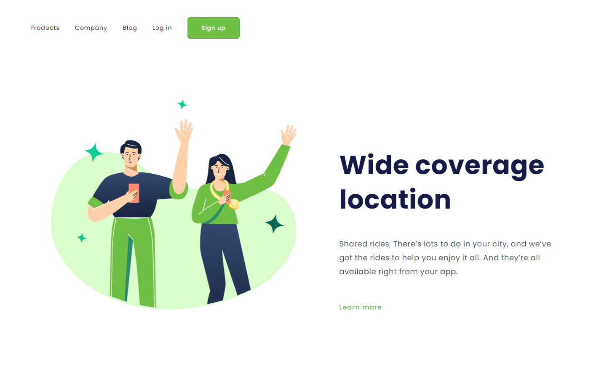
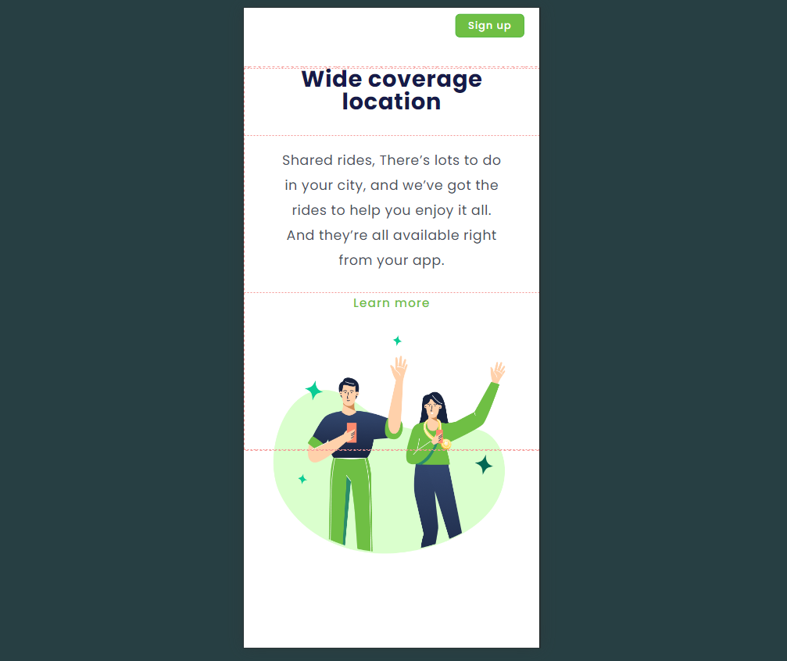

<h1>Projeto Wide Coverage</h1>
 

<h2> <a href="https://alissonclaro.github.io/wide-coverage/" target="_blank"> Wide coverage </a>  <---- Link.</h2>  

 
 
<h2>Projeito feito em aula referente a <a href="https://aulas.devclub.com.br">DevClub</a></h2>
 
<h2>Imagens do projeto</h2>

 
<h2>Imagens do projeto mobile</h2>

